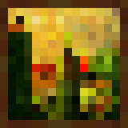
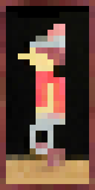
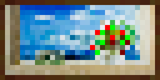
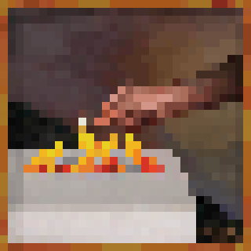
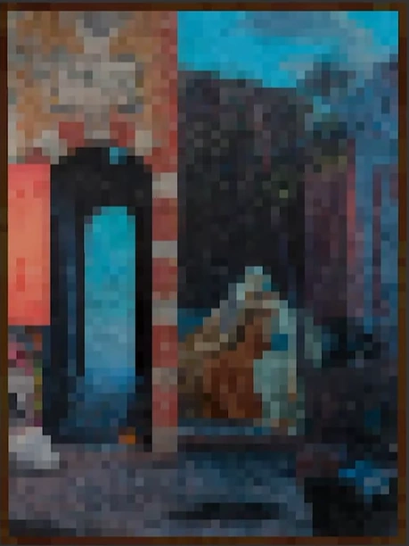
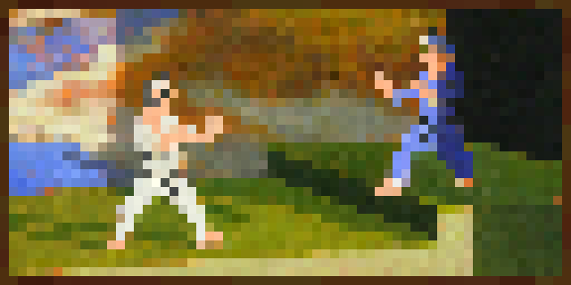
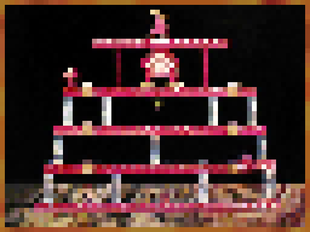
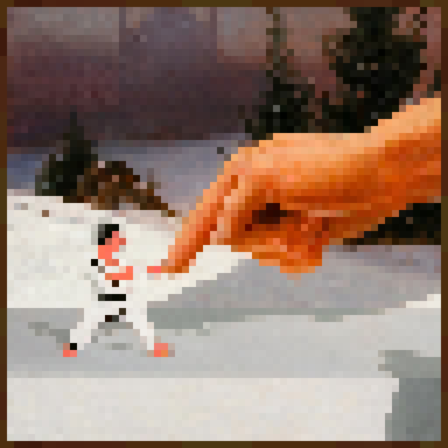

# Wyrdcraft Custom Painting Assets

This document covers the resource-pack side of Wyrdcraft custom paintings.

Custom paintings require both:

* This resource pack for textures, item icons, item models, and language entries.
* The [Wyrdcraft custom paintings datapack](https://github.com/WyrdcraftOnline/wyrd-paintings) for painting variants, recipes, and server-side behavior.

## Creating Your Painting

Custom painting textures should be created at the same size as the datapack painting variant's `width` and `height` values.

Default Minecraft painting borders can be found in the `helpers/` folder. Finished examples for each supported size can be found in `helpers/example/`.

Use the helper that matches the painting variant `width` and `height` values:

| Painting Size | Canvas Size | Border Helper | Example Image |
| --- | ---: | --- | --- |
| 1x1 | 160x160 | `helpers/border-1_1.png` |  |
| 1x2 | 160x320 | `helpers/border-1_2.png` |  |
| 2x1 | 320x160 | `helpers/border-2_1.png` |  |
| 2x2 | 320x320 | `helpers/border-2_2.png` |  |
| 3x4 | 459x612 | `helpers/border-3_4.png` |  |
| 4x2 | 640x320 | `helpers/border-4_2.png` |  |
| 4x3 | 640x480 | `helpers/border-4_3.png` |  |
| 4x4 | 640x640 | `helpers/border-4_4.png` |  |

For example, a datapack variant with `"width": 4` and `"height": 3` should use the `4x3` helper and a `640x480` painting texture.

## Required Resource-Pack Files

You can generate the resource-pack files interactively by running:

```sh
make painting
```

The script asks for the painting image and datapack asset ID, then lets you choose an existing item icon from `season_one/assets/wyrd_painting/textures/item/`. It copies the painting texture into the active season selected by `season.txt`, creates the item model if one does not already exist for the selected icon, and updates `painting.json`.

The datapack asset ID must exactly match the asset ID used in the custom paintings datapack. For example, if the datapack variant is `wyrd_painting:dadmannwalking01`, enter `dadmannwalking01`.

At minimum, check these files and folders:

```text
season_one/assets/wyrd_painting/textures/painting/
season_one/assets/wyrd_painting/textures/item/
season_one/assets/wyrd_painting/models/item/
season_one/assets/minecraft/items/painting.json
```

## Painting Texture

Add the final painting artwork to:

```text
season_one/assets/wyrd_painting/textures/painting/
```

The file name must match the datapack painting variant ID.

Example:

```text
season_one/assets/wyrd_painting/textures/painting/dadmannwalking01.png
```

## Item Icon

Choose an existing item icon texture from:

```text
season_one/assets/wyrd_painting/textures/item/
```

The generator does not create new item icons. All expected item icons should already be present in this folder.

Example:

```text
season_one/assets/wyrd_painting/textures/item/dadmannwalking.png
```

## Item Model

Add the item model JSON to:

```text
season_one/assets/wyrd_painting/models/item/
```

Example:

```json
{
  "parent": "minecraft:item/generated",
  "textures": {
    "layer0": "wyrd_painting:item/dadmannwalking"
  }
}
```

## Painting Item Mapping

Update:

```text
season_one/assets/minecraft/items/painting.json
```

The resource pack `painting.json` must map the datapack painting variant to the correct item model.

Example:

```json
{
  "when": "wyrd_painting:dadmannwalking01",
  "model": {
    "type": "model",
    "model": "wyrd_painting:item/dadmannwalking"
  }
}
```

## Checklist

Before opening a resource-pack pull request for a painting, make sure you have:

* Added the painting texture
* Selected the correct existing item icon texture
* Added the item model
* Updated `season_one/assets/minecraft/items/painting.json`
* Confirmed the matching datapack PR exists or has already been merged
* Tested the painting in game if possible
